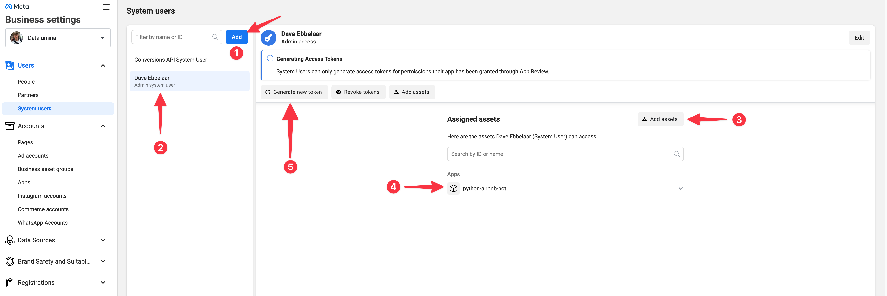
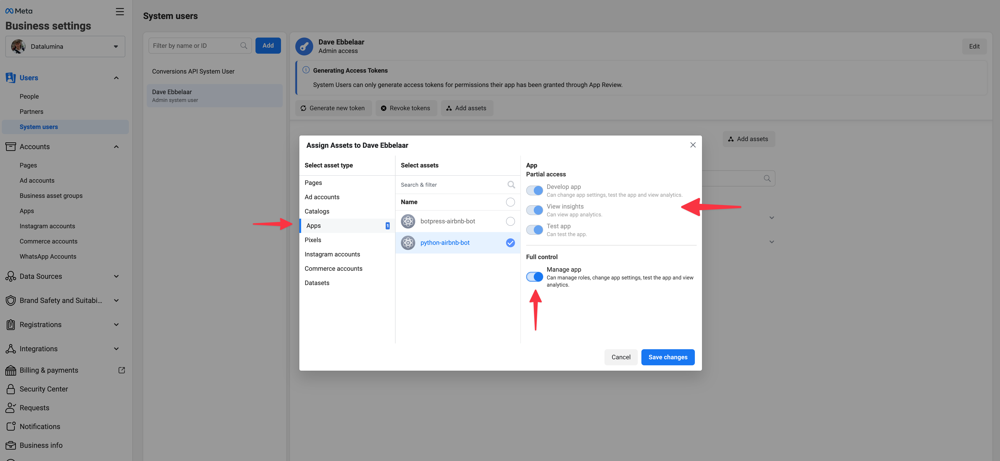

# Build AI WhatsApp Bots with Node.js

This guide will walk you through the process of creating a WhatsApp bot using the Meta (formerly Facebook) Cloud API with pure Python, and Flask particular. We'll also integrate webhook events to receive messages in real-time and use OpenAI to generate AI responses. 

## Prerequisites

1. A Meta developer account — If you don’t have one, you can [create a Meta developer account here](https://developers.facebook.com/).
2. A business app — If you don't have one, you can [learn to create a business app here](https://developers.facebook.com/docs/development/create-an-app/). If you don't see an option to create a business app, select **Other** > **Next** > **Business**.
3. Familiarity with Node to follow the tutorial.


## Table of Contents

- [Build AI WhatsApp Bots with Node.js](#build-ai-whatsapp-bots-with-Node.js)
  - [Prerequisites](#prerequisites)
  - [Table of Contents](#table-of-contents)
  - [Get Started](#get-started)
  - [Step 1: Select Phone Numbers](#step-1-select-phone-numbers)
  - [Step 2: Send Messages with the API](#step-2-send-messages-with-the-api)
  - [Step 3: Configure Webhooks to Receive Messages](#step-3-configure-webhooks-to-receive-messages)
      - [Start your app](#start-your-app)
      - [Launch ngrok](#launch-ngrok)
      - [Integrate WhatsApp](#integrate-whatsapp)
      - [Testing the Integration](#testing-the-integration)
  - [Step 4: Understanding Webhook Security](#step-4-understanding-webhook-security)
      - [Verification Requests](#verification-requests)
      - [Validating Verification Requests](#validating-verification-requests)
      - [Validating Payloads](#validating-payloads)
  - [Step 5: Learn about the API and Build Your App](#step-5-learn-about-the-api-and-build-your-app)
  - [Step 6: Integrate AI into the Application](#step-6-integrate-ai-into-the-application)
  - [Step 7: Add a Phone Number](#step-7-add-a-phone-number)
  - [Problems](#problems)


## Get Started

1. **Overview & Setup**: Begin your journey [here](https://developers.facebook.com/docs/whatsapp/cloud-api/get-started).
2. **Locate Your Bots**: Your bots can be found [here](https://developers.facebook.com/apps/).
3. **WhatsApp API Documentation**: Familiarize yourself with the [official documentation](https://developers.facebook.com/docs/whatsapp).
4. **API Docs for Sending Messages**: Check out [this documentation](https://developers.facebook.com/docs/whatsapp/cloud-api/guides/send-messages).

## Step 1: Select Phone Numbers

- Make sure WhatsApp is added to your App.
- You will get a test number that you can use to send messages (as bot) to up to 5 numbers.
- Go to API Setup and locate the test number from which you will be sending messages.
- Here, you can also add numbers to send messages to the bot. Enter your **own WhatsApp number**.
- You will receive a code on your phone via WhatsApp to verify your number.

## Step 2: Send Messages with the API

1. Obtain a 24-hour access token from the API access section.
2. It will show an example of how to send messages using a `curl` command which can be send from the terminal or with a tool like Postman.
3. Convert that into a Javascript.
4. Create a `.env` files based on `example.env` and update the required variables.
5. You will receive a "Hello World" message (Expect a 60-120 second delay for the message).

Creating an access that works longer then 24 hours
1. Create a [system user at the Meta Business account level](https://business.facebook.com/settings/system-users).
2. On the System Users page, configure the assets for your System User, assigning your WhatsApp app with full control. Don't forget to click the Save Changes button.


3. Now click `Generate new token` and select the app, and then choose how long the access token will be valid. You can choose 60 days or never expire.
4. Select all the permissions, as I was running into errors when I only selected the WhatsApp ones.
5. Confirm and copy the access token.

Now we have to find the following information on the **App Dashboard**:

- **APP_ID**: "<YOUR-WHATSAPP-BUSINESS-APP_ID>" (Found at App Dashboard)
- **APP_SECRET**: "<YOUR-WHATSAPP-BUSINESS-APP_SECRET>" (Found at App Dashboard)
- **VERSION**: "v20.0" (The latest version of the Meta Graph API)
- **ACCESS_TOKEN**: "<YOUR-SYSTEM-USER-ACCESS-TOKEN>" (Created in the previous step)


## Step 3: Configure Webhooks to Receive Messages

#### Start your app
- npm i
- npm run dev

#### Integrate WhatsApp

In the Meta App Dashboard, go to WhatsApp > Configuration, then click the Edit button.
1. In the Edit webhook's callback URL popup, enter the URL provided by the serveo to expose your application to the internet in the Callback URL field, with /webhook at the end (i.e. https://<subdomain>.serveo.net/webhook).
2. Enter a verification token. This string is set up by you when you create your webhook endpoint. You can pick any string you like. Make sure to update this in your `WEBHOOK_VERIFY_TOKEN` environment variable.
3. After you add a webhook to WhatsApp, WhatsApp will submit a validation post request to your application through ngrok. Confirm your localhost app receives the validation get request and logs `WEBHOOK_VERIFIED` in the terminal.
4. Back to the Configuration page, click Manage.
5. On the Webhook fields popup, click Subscribe to the **messages** field. Tip: You can subscribe to multiple fields.
6. If your Flask app and ngrok are running, you can click on "Test" next to messages to test the subscription. You recieve a test message in upper case. If that is the case, your webhook is set up correctly.


#### Testing the Integration
Use the phone number associated to your WhatsApp product or use the test number you copied before.
1. Add this number to your WhatsApp app contacts and then send a message to this number.
2. Confirm your localhost app receives a message and logs both headers and body in the terminal.
3. Test if the bot replies back to you in upper case.
4. You have now succesfully integrated the bot! 🎉
5. Now it's time to acutally build cool things with this.


## Step 4: Understanding Webhook Security

Below is some information from the Meta Webhooks API docs about verification and security. It is already implemented in the code, but you can reference it to get a better understanding of what's going on in [security.py](https://github.com/daveebbelaar/python-whatsapp-bot/blob/main/app/decorators/security.py)

#### Verification Requests

[Source](https://developers.facebook.com/docs/graph-api/webhooks/getting-started#:~:text=process%20these%20requests.-,Verification%20Requests,-Anytime%20you%20configure)

Anytime you configure the Webhooks product in your App Dashboard, we'll send a GET request to your endpoint URL. Verification requests include the following query string parameters, appended to the end of your endpoint URL. They will look something like this:

```
GET https://www.your-clever-domain-name.com/webhook?
  hub.mode=subscribe&
  hub.challenge=1158201444&
  hub.verify_token=meatyhamhock
```

The verify_token, `meatyhamhock` in the case of this example, is a string that you can pick. It doesn't matter what it is as long as you store in the `VERIFY_TOKEN` environment variable.

#### Validating Verification Requests

[Source](https://developers.facebook.com/docs/graph-api/webhooks/getting-started#:~:text=Validating%20Verification%20Requests)

Whenever your endpoint receives a verification request, it must:
- Verify that the hub.verify_token value matches the string you set in the Verify Token field when you configure the Webhooks product in your App Dashboard (you haven't set up this token string yet).
- Respond with the hub.challenge value.

#### Validating Payloads

[Source](https://developers.facebook.com/docs/graph-api/webhooks/getting-started#:~:text=int-,Validating%20Payloads,-We%20sign%20all)

WhatsApp signs all Event Notification payloads with a SHA256 signature and include the signature in the request's X-Hub-Signature-256 header, preceded with sha256=. You don't have to validate the payload, but you should.

To validate the payload:
- Generate a SHA256 signature using the payload and your app's App Secret.
- Compare your signature to the signature in the X-Hub-Signature-256 header (everything after sha256=). If the signatures match, the payload is genuine.


## Step 5: Learn about the API and Build Your App

Review the developer documentation to learn how to build your app and start sending messages. [See documentation](https://developers.facebook.com/docs/whatsapp/cloud-api).

## Step 6: Integrate AI into the Application

Now that we have an end to end connection, we can make the bot a little more clever then just shouting at us in upper case. All you have to do is come up with your own `generate_response()` function in [whatsapp_utils.py](https://github.com/daveebbelaar/python-whatsapp-bot/blob/main/app/utils/whatsapp_utils.py).

If you want a cookie cutter example to integrate the OpenAI Assistans API with a retrieval tool, then follow these steps.
1. Watch this video: [OpenAI Assistants Tutorial](https://www.youtube.com/watch?v=0h1ry-SqINc)
2. Create your own assistant with OpenAI and update your `OPENAI_API_KEY` and `OPENAI_ASSISTANT_ID` in the environment variables.
3. Provide your assistant with data and instructions
4. Update [openai_service.py](https://github.com/daveebbelaar/python-whatsapp-bot/blob/main/app/services/openai_service.py) to your use case.
5. Import `generate_reponse` into [whatsapp_utils.py](https://github.com/daveebbelaar/python-whatsapp-bot/blob/main/app/utils/)
6. Update `process_whatsapp_message()` with the new `generate_reponse()` function.

## Step 7: Add a Phone Number

When you’re ready to use your app for a production use case, you need to use your own phone number to send messages to your users.

To start sending messages to any WhatsApp number, add a phone number. To manage your account information and phone number, [see the Overview page.](https://business.facebook.com/wa/manage/home/) and the [WhatsApp docs](https://developers.facebook.com/docs/whatsapp/phone-numbers/).

If you want to use a number that is already being used in the WhatsApp customer or business app, you will have to fully migrate that number to the business platform. Once the number is migrated, you will lose access to the WhatsApp customer or business app. [See Migrate Existing WhatsApp Number to a Business Account for information](https://developers.facebook.com/docs/whatsapp/cloud-api/get-started/migrate-existing-whatsapp-number-to-a-business-account).

Once you have chosen your phone number, you have to add it to your WhatsApp Business Account. [See Add a Phone Number](https://developers.facebook.com/docs/whatsapp/cloud-api/get-started/add-a-phone-number).

When dealing with WhatsApp Business API and wanting to experiment without affecting your personal number, you have a few options:

1. Buy a New SIM Card
2. Virtual Phone Numbers
3. Dual SIM Phones
4. Use a Different Device
5. Temporary Number Services
6. Dedicated Devices for Development

**Recommendation**: If this is for a more prolonged or professional purpose, using a virtual phone number service or purchasing a new SIM card for a dedicated device is advisable. For quick tests, a temporary number might suffice, but always be cautious about security and privacy. Remember that once a number is associated with WhatsApp Business API, it cannot be used with regular WhatsApp on a device unless you deactivate it from the Business API and reverify it on the device.

## Problems

if you encounter problem kindly read any of these doc
https://github.com/chroma-core/chroma/issues/189#issuecomment-1454418844 for issues related to chromadb